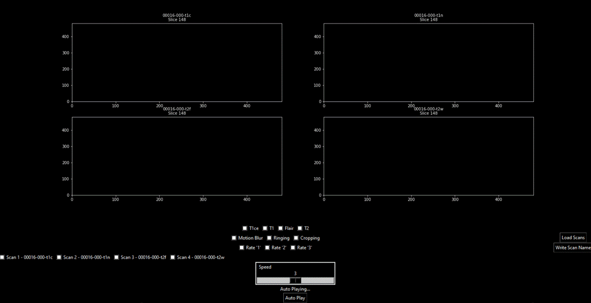

# 🧠 BrainMRI Synthesis: Advanced Medical Imaging with GANs

[](LICENSE)
[](https://www.python.org/)
[](https://www.tensorflow.org/)

Transform single MRI sequences into comprehensive multi-sequence scans using advanced GANs with Squeeze-Attention U-Net architecture.

## 🌟 Key Features

- Generate missing MRI sequences (T1, T2, FLAIR, T1ce) from available sequences
- Data Cleansing For Better Results
- Integrated DICOM viewer with advanced processing tools
- High-quality synthesis using Squeeze-Attention U-Net and PatchGAN
- Comprehensive preprocessing pipeline for optimal results

## Preparing The Data
### Application for Reviewing MRI Sequences
- Our developed application provides an interface for reviewing MRI sequences side-by-side, enabling efficient detection and assessment of artifacts in each slice of the sequences.



## 🎯 Model Architecture

### Generator Network
[Place your Generator Network Architecture image here]


### Discriminator Network
[Place your Discriminator Network Architecture image here]


### Complete GAN Framework
[Place your Complete GAN Framework image here]


## 📊 Results

### Synthesis Results
[Place your synthesis results GIF/images here]


### Performance Metrics

#### T1 Synthesis Results
| Input Sequence | SSIM    | MAE   | PSNR   |
|----------------|---------|-------|---------|
| T2 → T1        | 86.77%  | 0.042 | 24.91  |
| T1CE → T1      | 90.63%  | 0.033 | 26.43  |
| FLAIR → T1     | 86.29%  | 0.043 | 24.42  |

[Place your T1 Loss Graph here]


#### T2 Synthesis Results
| Input Sequence | SSIM    | MAE   | PSNR   |
|----------------|---------|-------|---------|
| T1 → T2        | 90.83%  | 0.027 | 27.46  |
| T1CE → T2      | 90.77%  | 0.022 | 28.42  |
| FLAIR → T2     | 90.32%  | 0.022 | 28.05  |

[Place your T2 Loss Graph here]


## 💻 Web Application Demo
[Place your web application demo GIF here]


## 🛠️ Technical Requirements

### Model Dependencies
```
- NumPy
- TensorFlow
- Keras
- CV2
- Matplotlib
```

### Web Application
```
- React Native
- FastAPI
```

### Hardware Requirements
```
- GPU: Tesla K80 (11.9GB)
- CPU: 16 cores, 2400MHz
- RAM: 125.37GB
```

## 🚀 Getting Started

1. Clone the repository:
```bash
git clone https://github.com/yourusername/brainmri-synthesis.git
cd brainmri-synthesis
```

2. Install dependencies:
```bash
pip install -r requirements.txt
```

3. Set up the web application:
```bash
cd webapp
npm install
```

4. Run the application:
```bash
# Start backend
python app.py

# Start frontend
npm start
```

## 📊 Dataset

The project utilizes the BraTS2023 dataset:
- 1,251 subjects
- Multiple MRI sequences (T1, T2, T1ce, FLAIR)
- Expert-annotated by neuroradiologists
- Standardized dimensions: 240×240×155 voxels

## 🔍 Project Structure
```
brainmri-synthesis/
├── model/
│   ├── generator.py
│   ├── discriminator.py
│   └── training.py
├── preprocessing/
│   ├── normalize.py
│   └── augmentation.py
├── webapp/
│   ├── frontend/
│   └── backend/
├── data/
│   └── processed/
├── results/
│   └── experiments/
└── docs/
```

## 📄 License

This project is licensed under the MIT License - see the [LICENSE](LICENSE) file for details.


## 🙏 Acknowledgments

- Dr. Amr S. Ghoneim for supervision and guidance
- BA-HPC Bibliotheca Alexandrina support team
